# Contractive Uncertainty-triggered Recovery for Expert-free Imitation Learning

*Team 6 — Yechan Lee, Tuva Bjørbekk, Chaewoon Bae*
*AI 617: ML for Robotics (Spring 2026) · 2026.06.18*

> Code: [github.com/tuuktuc86/CURE_IL](https://github.com/tuuktuc86/CURE_IL)

Imitation learning is one of the simplest and most practical ways to obtain a policy. Collect a few expert demonstrations, then fit a policy that maps states to actions. The trouble starts the moment the policy takes control. A small action error nudges it into a state it never saw during training; from there the next action is a little more wrong, the next state a little stranger, and the errors compound. Picture a car that drifts a few centimeters off the demonstrated lane and, never having seen the shoulder, has no idea how to steer back. This is distribution shift, and a behavior cloning (BC) policy has no built-in way to recover once it has drifted off the demonstrated states.

DAgger is the standard fix. By querying the expert on the states the policy actually visits and adding those corrective labels back into the dataset, DAgger directly attacks the compounding-error problem. But the fix comes with a recurring cost — a human has to stay in the loop. A human observer must notice *when* the behavior deviates, and then supply the *correct* action. DAgger trades compounding error for heavy human-expert involvement throughout training.

So we asked a blunt question. Can we take the human out of the loop entirely? Our answer is **CURE-IL** (Contractive Uncertainty-triggered Recovery for Expert-free Imitation Learning), a query-free, DAgger-style framework that leans on contraction theory and uncertainty estimation to recover on its own.

<p align="center">
  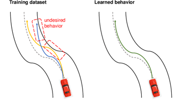
  &nbsp;&nbsp;
  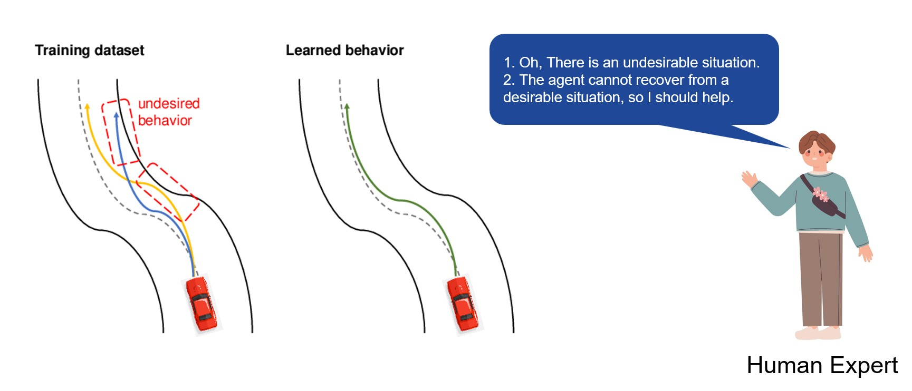
</p>

*Figure 1. How a human expert intervenes in DAgger. On a perturbed rollout the expert has to recognize the undesirable situation and decide that the agent cannot recover on its own, then provide a correction. CURE-IL aims to replace this human judgment with an automatic recovery mechanism.*

## The question

Recent work has chipped away at the human-intervention cost, but mostly along a single axis — *detecting* when behavior deviates.

- **RND-DAgger** uses Random Network Distillation (RND) to estimate uncertainty and decide when to query the expert.
- **CR-DAgger** enables smooth human corrections during ongoing execution and learns a force-aware residual policy.
- **ConformalDAgger** uses online conformal prediction to estimate uncertainty and decide when to query the expert.

Each of these makes the expert query rarer, but every one of them still assumes a human is standing by to answer when called. The question driving CURE-IL goes one step further.

> Can we design a DAgger framework that removes the need for a human expert altogether?

Detection alone cannot get us there. If no one is going to answer the query, knowing *that* the policy has drifted is useless unless the policy can also fix it on its own. It needs a way to *recover*, not just a way to raise its hand. That is where contraction theory comes in.

## Background: does contraction theory recover state?

Contraction theory studies a dynamical system $\dot{x} = f(x,t)$ — with state $x \in \mathbb{R}^n$ (here $n$ is the state dimension), time $t$, and dynamics $f$ — for which the distance between any two solution trajectories $\xi_0(t)$ and $\xi_1(t)$, launched from different initial conditions $\xi_0(0)$ and $\xi_1(0)$, shrinks exponentially over time. Concretely, the system is exponentially stable if there exist constants $C > 0$ (an overshoot constant) and $\alpha > 0$ (the contraction rate) such that

$$\lVert \xi_1(t) - \xi_0(t) \rVert \le C e^{-\alpha t} \lVert \xi_1(0) - \xi_0(0) \rVert,$$

where $\lVert \cdot \rVert$ is the Euclidean norm. Equivalently — and more usefully for checking a given system — contraction holds if either differential condition below is satisfied.

$$\lambda_{\max}\left(\mathrm{sym}\big(F(x,t)\big)\right) = \lambda\left(\mathrm{sym}\left(\dot{\Theta} + \Theta \frac{\partial f}{\partial x} \Theta^{-1}\right)\right) \le -\alpha,$$

$$\dot{M} + M \frac{\partial f}{\partial x} + \frac{\partial f}{\partial x}^{\top} M \preceq -2\alpha M.$$

Here $\tfrac{\partial f}{\partial x}$ is the Jacobian of the dynamics $f$; $\mathrm{sym}(A) = \tfrac{1}{2}\big(A + A^{\top}\big)$ denotes the symmetric part of a matrix $A$; $\lambda_{\max}(\cdot)$ — abbreviated $\lambda(\cdot)$ in the middle expression — is the largest eigenvalue of its argument; $\Theta(x,t)$ is a differential coordinate transformation with time-derivative $\dot{\Theta}$, and $F(x,t) = \big(\dot{\Theta} + \Theta \tfrac{\partial f}{\partial x}\big)\Theta^{-1}$ is the resulting generalized Jacobian; $M(x,t) = \Theta^{\top}\Theta \succ 0$ is the associated (positive-definite) contraction metric with time-derivative $\dot{M}$; and $A \preceq B$ means $B - A$ is positive semidefinite.

When this holds, every solution trajectory converges exponentially onto a *single* trajectory — like tributaries spread across a basin all draining into the same river. That one word, *single*, is the catch. Off-the-shelf contraction pulls *everything* toward one global attractor, which is exactly the wrong behavior for multimodal demonstrations, where different demonstrations are supposed to follow genuinely different paths.

Several recent methods learn contractive policies, each with a different parametrization.

- **CDP** (Contractive Diffusion Policies) regularizes the score Jacobian so that nearby denoising trajectories are pulled closer during sampling.
- **NCDS** (Neural Contractive Dynamical Systems) learns a nonlinear vector field that is explicitly constructed to be contractive.
- **ELCD** (Extended Linearized Contracting Dynamics) parametrizes the nonlinear vector field and constrains its symmetric part to be negative definite.
- **SCDS** (State-only Contractive Dynamical Systems) parametrizes the policy as a contractive dynamical system in a latent space using recurrent equilibrium networks.

<table>
  <tr>
    <td align="center" width="25%">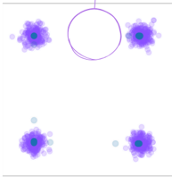<br><sub><b>CDP</b></sub></td>
    <td align="center" width="25%">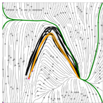<br><sub><b>NCDS</b></sub></td>
    <td align="center" width="25%">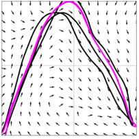<br><sub><b>ELCD</b></sub></td>
    <td align="center" width="25%">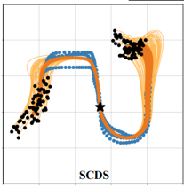<br><sub><b>SCDS</b></sub></td>
  </tr>
</table>

*Figure 2. Existing contractive policies (CDP, NCDS, ELCD, SCDS). They give exponential recovery, but the contraction is toward a single trajectory, which does not match multimodal demonstrations.*

## Method: CURE-IL

CURE-IL keeps the exponential recovery that contraction theory promises, but makes the contraction *mode-aware* — instead of forcing every trajectory into one riverbed, it carves a separate channel for each behavior and steers the policy back into the *right* one. Three pieces make this work.

Throughout, let $i$ index a demonstration trajectory and $t$ a timestep along it; let $s$ (written $s_{i,t}$ for the recorded demonstrations) be the state; let $\phi$ be the encoder that maps a state to its latent state $y = \phi(s)$; and let $z \in \lbrace 1,\dots,K \rbrace$ be one of $K$ behavior modes.

### Method 1 — Mode separation

Multimodal demonstrations are first separated into mode-specific trajectory funnels in latent space.

$$y_{i,t} = \phi(s_{i,t}), \qquad \mathcal{Y}_z = \lbrace y_{i,t} : z_{i,t} = z \rbrace.$$

Here $z_{i,t} \in \lbrace 1,\dots,K \rbrace$ is the mode label assigned to sample $(i,t)$, so each mode $z$ keeps its own trajectory tube $\mathcal{Y}_z$ — the set of all latent points belonging to that mode. Because recovery later targets the *selected* mode rather than a global mean, the policy recovers toward a coherent behavior instead of averaging incompatible ones, which is what a naive single-attractor contraction would do.

### Method 2 — Recover vs. switch

When uncertainty becomes high, CURE-IL switches from nominal execution to a recovery decision. The trigger is

$$U(s_t) > \tau,$$

where $s_t$ is the state at execution timestep $t$, the uncertainty $U$ is estimated with Random Network Distillation, and the threshold $\tau$ is calibrated with conformal prediction (the conformally-calibrated, uncertainty-triggered switch the name refers to).

Once triggered, the policy does not blindly recover to the current mode. It compares a recovery cost against a switch cost.

$$J(s_t) = \lambda_d\big(\lVert e_\perp(s_t)\rVert_2^2\big) + \lambda_u\big[U(s_t) - \tau\big].$$

Here $e_\perp(s_t)$ is the *perpendicular error* — how far the latent state $\phi(s_t)$ lies from the trajectory tube, measured orthogonally to it — and $\lVert \cdot \rVert_2$ is the Euclidean norm, so $\lVert e_\perp \rVert_2^2$ measures trajectory-funnel violation; $U(s_t) - \tau$ is the residual uncertainty left above the trigger; and $\lambda_d, \lambda_u \ge 0$ are weights that trade the two terms off. The decision is then simply

$$J_{\text{recover}} < J_{\text{switch}} \quad\Rightarrow\quad \text{recover to current mode}, \qquad J_{\text{switch}} < J_{\text{recover}} \quad\Rightarrow\quad \text{switch to another mode}.$$

Here $J_{\text{recover}}$ is $J(s_t)$ evaluated against the current mode's tube and $J_{\text{switch}}$ is the smallest such cost over the alternative modes. This is what lets CURE-IL handle deviations that are better resolved by committing to a different behavior than by forcing a return to the original one.

### Method 3 — Contraction recovery

After a mode $z$ is selected, CURE-IL applies a contraction field that pulls the latent state back toward the selected trajectory tube.

$$g(s) = \rho v(s) - K_\perp(s) e_\perp(s).$$

Here $v(s)$ is the unit tangent direction of the selected tube at $s$ (the way forward along the demonstration), $\rho > 0$ is a scalar gain that sets the forward speed, $K_\perp(s) \succ 0$ is a positive-definite contraction gain, and $e_\perp(s)$ is the same perpendicular error as in Method 2. The two terms then have clean interpretations.

- $\rho v(s)$ moves forward along the trajectory.
- $K_\perp(s) e_\perp(s)$ contracts the deviation back toward the trajectory tube.

The desired latent recovery velocity $g(s)$ therefore tracks progress along the demonstration while shrinking perpendicular error. Crucially, CURE-IL recovers to the *selected trajectory tube*, not to a single global attractor, which is the property plain contraction methods lack.

## Experiments

We compare CURE-IL against BC, SafeDAgger, and ELCD.

### 2D environments

The 2D setting asks two questions at once. After we knock the policy off course, does it climb back onto the demonstrated path, and does it still reach the goal? Mid-rollout we inject a perturbation and watch what each method does next.

<table>
  <tr>
    <td align="center" width="33%">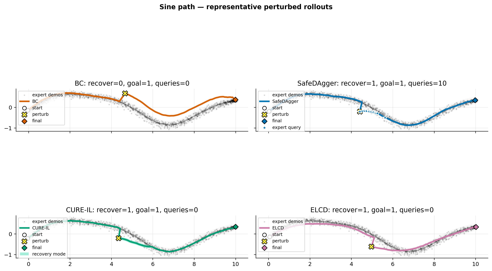<br><sub><b>Sine path</b></sub></td>
    <td align="center" width="33%">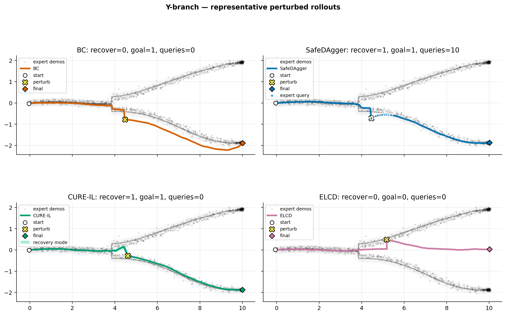<br><sub><b>Y-branch</b></sub></td>
    <td align="center" width="33%">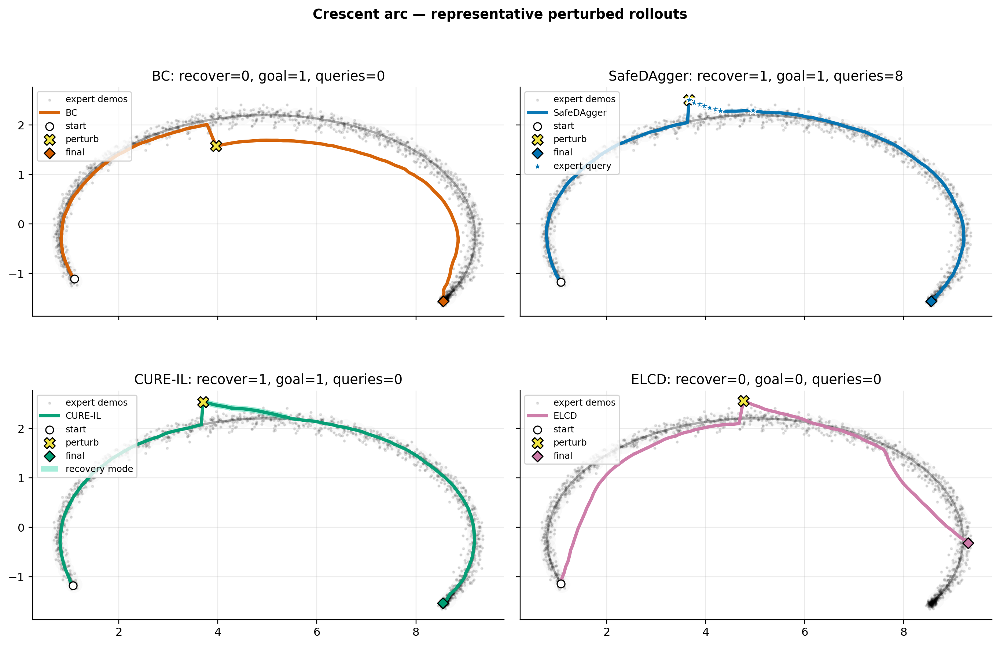<br><sub><b>Crescent arc</b></sub></td>
  </tr>
  <tr>
    <td align="center">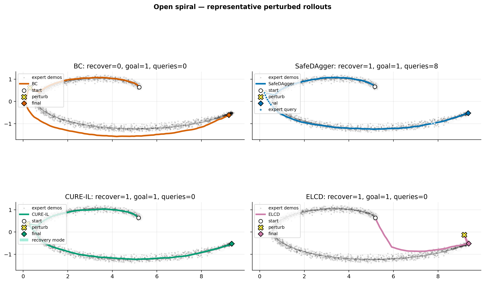<br><sub><b>Open spiral</b></sub></td>
    <td align="center">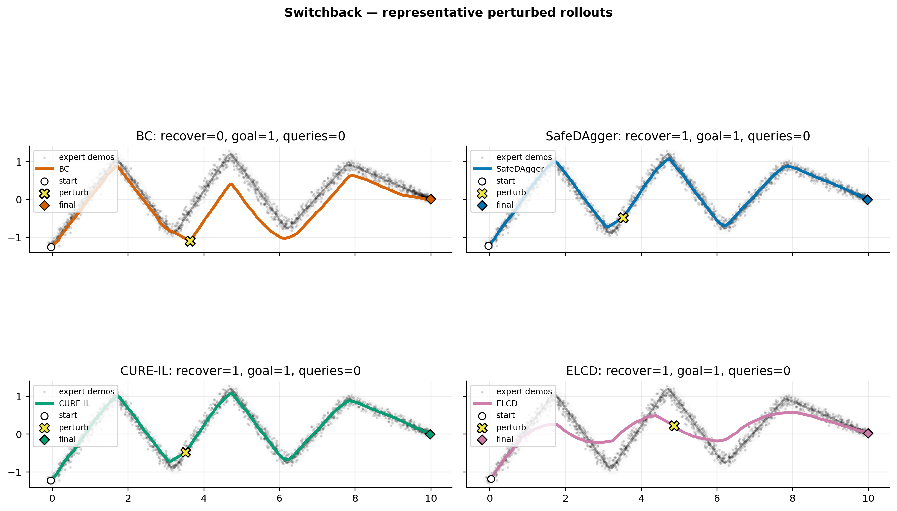<br><sub><b>Switchback</b></sub></td>
    <td></td>
  </tr>
</table>

*Figure 3. Representative perturbed rollouts across the five 2D trajectory shapes (sine path, Y-branch, crescent arc, open spiral, switchback). BC reaches the goal but recovers slowly to the demonstrated trajectory. SafeDAgger recovers quickly and reaches the goal but spends expert queries. ELCD recovers on unimodal paths but fails on the multimodal Y-branch, where contracting to a single trajectory averages the two branches. CURE-IL recovers quickly and reaches the goal with zero expert queries.*

The qualitative picture is consistent across tasks.

- **BC** reaches the goal but recovers slowly to the demonstrated trajectory.
- **SafeDAgger** recovers quickly and reaches the goal, but it requires expert queries.
- **ELCD**, a single-trajectory contraction baseline, recovers on unimodal paths but fails on the multimodal Y-branch.
- **CURE-IL** recovers quickly and reaches the goal without expert queries.

The quantitative results tell the same story across the five trajectory shapes. BC often reaches the goal but fails to recover to the demonstrated trajectory; SafeDAgger recovers but pays for it in expert queries; ELCD recovers on the unimodal tasks yet collapses on the multimodal Y-branch; and CURE-IL achieves strong recovery with zero queries.

*Table 1. 2D recovery results at perturbation magnitude δ = 0.45 (90 rollouts per cell). Recovery success is mean ± standard error. "Expert queries" counts online expert calls; CURE-IL and ELCD are query-free.*

| Task | Method | Goal success | Recovery success | Expert queries | Mean tube dist. |
|---|---|---|---|---|---|
| Sine path | BC | 1.000 | 0.000 ± 0.000 | 0.00 | 0.150 |
| Sine path | SafeDAgger | 1.000 | 0.544 ± 0.053 | 4.97 | 0.088 |
| Sine path | CURE-IL | 1.000 | 0.933 ± 0.026 | 0.00 | 0.064 |
| Sine path | ELCD | 0.956 | 0.956 ± 0.022 | 0.00 | 0.065 |
| Y-branch | BC | 1.000 | 0.722 ± 0.047 | 0.00 | 0.087 |
| Y-branch | SafeDAgger | 1.000 | 1.000 ± 0.000 | 6.03 | 0.054 |
| Y-branch | CURE-IL | 1.000 | 1.000 ± 0.000 | 0.00 | 0.051 |
| Y-branch | ELCD | 0.000 | 0.000 ± 0.000 | 0.00 | 1.117 |
| Crescent arc | BC | 1.000 | 0.011 ± 0.011 | 0.00 | 0.160 |
| Crescent arc | SafeDAgger | 1.000 | 0.533 ± 0.053 | 6.86 | 0.090 |
| Crescent arc | CURE-IL | 1.000 | 1.000 ± 0.000 | 0.00 | 0.062 |
| Crescent arc | ELCD | 1.000 | 1.000 ± 0.000 | 0.00 | 0.040 |
| Open spiral | BC | 1.000 | 0.022 ± 0.016 | 0.00 | 0.164 |
| Open spiral | SafeDAgger | 1.000 | 1.000 ± 0.000 | 6.40 | 0.071 |
| Open spiral | CURE-IL | 1.000 | 1.000 ± 0.000 | 0.00 | 0.049 |
| Open spiral | ELCD | 1.000 | 1.000 ± 0.000 | 0.00 | 0.039 |
| Switchback | BC | 1.000 | 0.544 ± 0.053 | 0.00 | 0.091 |
| Switchback | SafeDAgger | 1.000 | 1.000 ± 0.000 | 4.52 | 0.054 |
| Switchback | CURE-IL | 1.000 | 1.000 ± 0.000 | 0.00 | 0.044 |
| Switchback | ELCD | 1.000 | 1.000 ± 0.000 | 0.00 | 0.040 |

SafeDAgger pays roughly 5–7 expert queries per task and still recovers only partially on the curved Sine and Crescent tasks. CURE-IL matches or beats it on every task at zero query cost. ELCD — also contraction-based — recovers as well as CURE-IL on the unimodal tasks, but collapses on the multimodal Y-branch (mean tube distance 1.12), where only CURE-IL's mode-aware contraction keeps the policy on the correct branch.

### Robomimic

We then leave the plane behind for simulated manipulation in Robomimic — the Lift, Can, and Square tasks. As before, we perturb each rollout at a fixed step and ask how often the policy recovers, both overall and within a fixed window.

<table>
  <tr>
    <th width="10%"></th>
    <th width="22.5%">BC</th>
    <th width="22.5%">SafeDAgger</th>
    <th width="22.5%">ELCD</th>
    <th width="22.5%">CURE-IL</th>
  </tr>
  <tr>
    <td align="center"><b>Can</b></td>
    <td>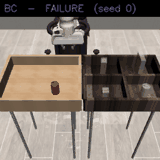<br><sub align="center">✗ failure</sub></td>
    <td>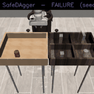<br><sub align="center">✗ failure</sub></td>
    <td>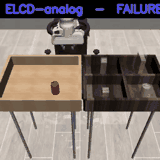<br><sub align="center">✗ failure</sub></td>
    <td>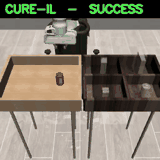<br><sub align="center">✓ success</sub></td>
  </tr>
  <tr>
    <td align="center"><b>Lift</b></td>
    <td>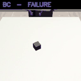<br><sub align="center">✗ failure</sub></td>
    <td>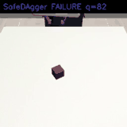<br><sub align="center">✗ failure</sub></td>
    <td>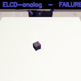<br><sub align="center">✗ failure</sub></td>
    <td>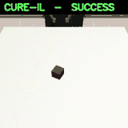<br><sub align="center">✓ success</sub></td>
  </tr>
</table>

*Figure 4. Robomimic rollouts on Can and Lift after a perturbation. BC, SafeDAgger, and ELCD fail to recover on these instances, while CURE-IL succeeds.*

*Table 2. Robomimic task recovery success. Best per column in bold.*

| Method | Lift | Can | Square |
|---|---|---|---|
| BC | 0.77 | 0.73 | 0.25 |
| SafeDAgger | 0.82 | 0.80 | 0.47 |
| ELCD | 0.63 | 0.39 | 0.00 |
| **CURE-IL** | **0.89** | **0.85** | **0.51** |

CURE-IL outperforms all baselines across Lift, Can, and Square. The gap is widest on the harder Square task, where both BC and ELCD struggle (ELCD fails completely). This suggests that demonstration re-execution — re-grasping the displaced object rather than only returning the arm to the tube — is what lets CURE-IL handle complex manipulation without expert queries.

*Note: the Robomimic numbers above are from the earlier run. The SafeDAgger and ELCD baselines have since been reimplemented as independent methods (a query-paying nearest-demonstration expert and a contraction-to-tube policy), so re-running `src/cure_robomimic` on the dataset will refresh this table.*

## Conclusion and discussion

CURE-IL shows that the human in DAgger's loop can, at least in these settings, be replaced by structure. It recovers without a single online expert query, and the experiments bear this out in both the 2D environments and Robomimic manipulation. The whole idea is to make contraction *mode-aware* — separate the demonstrations into trajectory tubes, let calibrated uncertainty decide whether to recover or switch, then contract toward the *selected* tube instead of a single global attractor.

A few limitations point to future work.

- The distance-based contraction limits the task settings where the method applies.
- Gripper control is currently handled by rule-based logic rather than learned.
- The method assumes clearly separable behavior modes, which may not hold for all demonstration sets.

## Reproducing the experiments

The repository contains the 2D recovery suite (`src/contractive_recovery_il/`) and the
Robomimic manipulation code (`src/cure_robomimic/`).

```bash
# install dependencies
python -m pip install -r requirements.txt

# run the 2D recovery experiments (quick, single seed)
python scripts/run_experiments.py --quick --seed 0

# run the tests
pytest -q
```

## References

1. *Efficient Active Imitation Learning with Random Network Distillation.* ICLR 2025.
2. *Improving Real-World Contact-Rich Manipulation with Human Corrections.* NeurIPS 2025.
3. *Conformalized Interactive Imitation Learning for Handling Expert Shift and Intermittent Feedback.* ICLR 2025.
4. *Contractive Diffusion Policies.* ICLR 2026.
5. *Neural Contractive Dynamical Systems.* arXiv, 2024.
6. *Learning Neural Contracting Dynamics: Extended Linearization and Global Guarantees.* NeurIPS 2024.
7. *Contractive Dynamical Imitation Policies for Efficient Out-of-Sample Recovery.* ICLR 2025.
8. *Query-Efficient Imitation Learning for End-to-End Autonomous Driving (SafeDAgger).* AAAI 2017.
9. *A Reduction of Imitation Learning and Structured Prediction to No-Regret Online Learning (DAgger).* AISTATS 2011.
